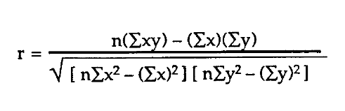

# InstantAI-Numpy-SQL-Tasks
# Instant AI Numpy-SQL Task

## HOW TO CALCULATE THE CORRELATION

correlation coefficient is the measurement of the strength between 2 separate variables. and it is concerned with the state of the relation. there are 3 types of correlation coefficient:
* Pearson Correlation
* Spearman Correlation
* Kendall Correlation

when 2 sets of data are strongly linked together we say they have a high correlation

correlation possible values:
* 1 a perfect positive correlation the values increase together .
* -1 a perfect negative correlation one value increases and the other decreases.
* 0 No Correlation no link meaning that the relationship between these variables is considered weak

### the formula 

### Resources:
* [mathsisfun](https://www.mathsisfun.com/data/correlation.html)
* [indeed](https://www.indeed.com/career-advice/career-development/how-to-calculate-correlation-coefficient?__cf_chl_tk=Taal73UNEtInvsQTomnmMS2EhVcLw1MtoGuhBC9tOzI-1691436456-0-gaNycGzNEmU)

# Rana (2023)
